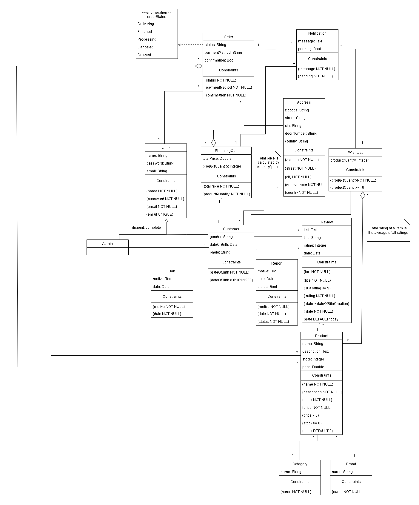

# EBD: Database Specification

## A4 - Conceptual Data Model

This artefact contains the conceptual data model for our project and business rules.

### 1. Class Diagram



### 2. Business Rules

The business rules are specified in the class diagram using independent notes.

---

## A5 - Relational Schema, Validation and Schema Refinement

In this section, we show the relational schema, the domains and the schema validation of our project's database.

### 1. Relational Schema

| Relation Reference | Relation |
|--------------------|----------|
| R01 | customer_user(<ins>id_user</ins>, name **NN**, password **NN**, gender, email **NN** **UK**, date_of_birth **NN**, photo, id_wish_list -> wishList **NN**, id_shopping_cart -> shopping_cart **NN**) |
| R02 | admin_user(<ins>id_user</ins>, name **NN**, password **NN**) |
| R03 | review(<ins>id_review</ins>, text **NN**, title **NN**, rating **NN**, date **NN**, id_user -> customerUser **NN**, id_product -> product **NN**) |
| R04 | product(<ins>id_product</ins>, name **NN**, description **NN**, price **NN**, stock **NN**, id_category -> category **NN**) |
| R05 | category(<ins>id_category</ins>, name **NN** **UK**) |
| R06 | brand(<ins>id_brand</ins>, name **NN** **UK**) |
| R07 | address(<ins>id_address</ins>, zipcode **NN**, street **NN**, city **NN**, door_number **NN**, country **NN**) |
| R08 | notification(<ins>id_notification</ins>, message **NN**, pending **NN**, id_shopping_cart -> shopping_cart, id_order -> order, id_wishList -> wishList) |
| R09 | order(<ins>id_order</ins>, status **NN**, id_address -> address **NN**, payment_method **NN**, confirmation **NN**, id_user -> customer_user **NN**) |
| R10 | shopping_cart(<ins>id_shopping_cart</ins>, total_price **NN**, product_quantity **NN**) |
| R11 | report(<ins>id_review</ins> -> review, <ins>id_user</ins> -> customer_user, motive **NN**, date **NN**, status **NN**) |
| R12 | wish_list(<ins>id_wish_list</ins>, product_quantity **NN**) |
| R13 | ban (<ins>id_user</ins> -> admin_user, <ins>id_user</ins> -> customer_user, motive **NN**, date **NN**) |
| R14 | add_to_wish_list(<ins>id_product</ins> -> product, <ins>id_wish_list</ins> -> wishList) |
| R15 | add_to_shopping_cart(<ins>id_product</ins> -> product, <ins>id_shopping_cart</ins> -> shopping_cart) |
| R16 | add_to_order(<ins>id_product</ins> -> product, <ins>id_order</ins> -> order) |
| R17 | customer_address(<ins>id_user</ins> -> customer_user, <ins>id_address</ins> -> address) |

### 2. Domains

| Name | Specification |
|------|---------------|
| Today | DATE DEFAULT CURRENT_DATE |
| OrderStatus | ENUM ('Delivering', 'Finished', 'Processing') |

### 3. Schema Validation

| Table R01 | customer_user |
|-----------|---------------|
| Keys | {id_user}, {email} |
| Functional Dependencies |  |
| FD0101 | {id_user} -> {name, password, gender, email, date_of_birth, photo, id_wish_list, id_shopping_cart} |
| FD0102 | {email} -> {name, password, gender, id_user, date_of_birth, photo, id_wish_listt, id_shopping_cart} |
| Normal Form | BCNF |

| Table R02 | admin_user |
|-----------|------------|
| Keys | {id_user}, {email} |
| Functional Dependencies |  |
| FD0201 | {id_user} -> {name, password, email} |
| FD0202 | {email} -> {name, password, id_user} |
| Normal Form | BCNF |

| Table R03 | review |
|-----------|--------|
| Keys | {id_review} |
| Functional Dependencies |  |
| FD0301 | {id_review} -> {text, title, rating, date, id_user, id_product} |
| Normal Form | BCNF |

| Table R04 | product |
|-----------|---------|
| Keys | {id_product} |
| Functional Dependencies |  |
| FD0401 | {id_product} -> {name, description, price, stock, id_category, id_brand} |
| Normal Form | BCNF |

| Table R05 | category |
|-----------|----------|
| Keys | {id_category}, {name} |
| Functional Dependencies |  |
| FD0501 | {id_category} -> {name} |
| FD0502 | {name} -> {id_category} |
| Normal Form | BCNF |

| Table R06 | brand |
|-----------|-------|
| Keys | {id_brand}, {name} |
| Functional Dependencies |  |
| FD0601 | {id_brand} -> {name} |
| FD0602 | {name} -> {id_brand} |
| Normal Form | BCNF |

| Table R07 | address |
|-----------|---------|
| Keys | {id_address} |
| Functional Dependencies |  |
| FD0701 | {id_address} -> {zipcode, street, city, door_number, country} |
| Normal Form | BCNF |

| Table R08 | notification |
|-----------|--------------|
| Keys | {id_notification} |
| Functional Dependencies |  |
| FD0801 | {id_notification} → {message, pending, id_shopping_cart, id_order, id_wish_list} |
| Normal Form | BCNF |

| Table R09 | order |
|-----------|-------|
| Keys | {id_order} |
| Functional Dependencies |  |
| FD0901 | {id_order} → {status, id_address, payment_method, confirmation, id_user} |
| Normal Form | BCNF |

| Table R10 | shopping_cart |
|-----------|---------------|
| Keys | {id_shopping_cart} |
| Functional Dependencies |  |
| FD1001 | {id_shopping_cart} → {total_price, product_quantity} |
| Normal Form | BCNF |

| Table R11 | report |
|-----------|--------|
| Keys | {id_review, id_user} |
| Functional Dependencies |  |
| FD1101 | {id_review, id_user} → {motive, date, status} |
| Normal Form | BCNF |

| Table R12 | wish_list |
|-----------|-----------|
| Keys | {id_wish_list} |
| Functional Dependencies |  |
| FD1201 | {id_wish_list} → {product_quantity} |
| Normal Form | BCNF |

| Table R13 | ban |
|-----------|-----|
| Keys | {id_admin, id_user} |
| Functional Dependencies |  |
| FD1301 | {id_user -> admin_user, id_user -> customer_user} → {motive, date} |
| Normal Form | BCNF |

| Table R14 | add_to_wish_list |
|-----------|------------------|
| Keys | {id_product, id_wish_list} |
| Functional Dependencies | none |
| Normal Form | BCNF |

| Table R15 | add_to_shopping_cart |
|-----------|----------------------|
| Keys | {id_product, id_shopping_cart} |
| Functional Dependencies | none |
| Normal Form | BCNF |

| Table R16 | add_to_order |
|-----------|--------------|
| Keys | {id_product, id_order} |
| Functional Dependencies | none |
| Normal Form | BCNF |

| Table R17 | customer_address |
|-----------|------------------|
| Keys | {id_user, id_address} |
| Functional Dependencies | none |
| Normal Form | BCNF |

---

## A6: Indexes, triggers, user defined functions, transactions and population

In this artefact, we present the database workload, indexes, triggers, user defined functions, transactions and database population.

### 1. Database workload

| Relation | Relation name | Order of magnitude | Estimated growth |
|----------|---------------|--------------------|------------------|
| R01 | costumer_user | 10k(tens of thousands) | 10(tens)/day |
| R02 | admin_user | 10(tens) | 1(units)/month |
| R03 | review | 1k(thousands) | 10(ten)/day |
| R04 | product | 100(hundreds) | 10/week |
| R05 | category | 10 | 1/month |
| R06 | brand | 10 | 1/week |
| R07 | address | 10k | 10/day |
| R08 | notification | 10k | 100(hundred)/day |
| R09 | order | 1k | 10/day |
| R10 | shopping_cart | 100k | 10/day |
| R11 | report | 100 | 1/day |
| R12 | wish_list | 10k | 10/day |
| R13 | ban | 100 | 1/week |
| R14 | add_to_wish_list | 10k | 100/day |
| R15 | add_to_shopping_cart | 100k(hundreds of thousands) | 100/day |
| R16 | add_to_order | 10k | 10/day |
| R17 | customer_address | 10k | 10/day |

### 2. Proposed Indices

#### 2.1. Performance Indices

| Index reference | IDX01 |
|-----------------|-------|
| Index relation | review |
| Index attribute | id_product |
| Index type | Hash |
| Cardinality | Medium |
| Clustering | No |
| Justification | The table "review" is frequently accessed to obtain the reviews of a certain product. Since the filtering is done by exact match, the hash index type is the most suitable |

```sql
CREATE INDEX id_product_review ON review USING hash (id_product);
```

| Index reference | IDX02 |
|-----------------|-------|
| Index relation | orders |
| Index attribute | id_customer_user |
| Index type | hash |
| Cardinality | medium |
| Clustering | No |
| Justification | This index allows faster access to a customer's orders. We chose a hash index becuase the only operator that will be used is equality. |

```sql
CREATE INDEX id_customer_order ON orders USING hash(id_user);
```

| Index reference | IDX03 |
|-----------------|-------|
| Index relation | product |
| Index attribute | id_brand |
| Index type | B-tree |
| Cardinality | Low |
| Clustering | Yes |
| Justification | The table "product" is used for the users to access the products. Since the filtering has low cardinality and low update frequency we decided to have clustering. Since clustering is not possible on hash we decided to go for B-tree |

```sql
CREATE INDEX id_brand_product ON product USING btree (id_brand);
CLUSTER product USING id_brand;
```

| Index reference | IDX11 |
|-----------------|-------|
| Index relation | product |
| Index attribute | name,description |
| Index type | GIN |
| Clustering | No |
| Justification | User will frequently search for a product. As such we will need a full-text search index to get efficiently the results of that search. We choose GIN, since this products' information is static. |

```sql
ALTER TABLE product
ADD COLUMN tsvectors TSVECTOR;

CREATE OR REPLACE FUNCTION product_search_update() RETURNS TRIGGER AS $$
BEGIN
 IF TG_OP = 'INSERT' THEN
        NEW.tsvectors = (
         setweight(to_tsvector('english', NEW.name), 'A') ||
         setweight(to_tsvector('english', NEW.description), 'B')
        );
 END IF;
 IF TG_OP = 'UPDATE' THEN
         IF (NEW.name <> OLD.name OR NEW.description <> OLD.description) THEN
           NEW.tsvectors = (
             setweight(to_tsvector('english', NEW.name), 'A') ||
             setweight(to_tsvector('english', NEW.description), 'B')
           );
         END IF;
 END IF;
 RETURN NEW;
END $$
LANGUAGE plpgsql;

CREATE TRIGGER product_search_update
 BEFORE INSERT OR UPDATE ON product
 FOR EACH ROW
 EXECUTE PROCEDURE product_search_update();

CREATE INDEX product_search_idx ON product USING GIN (tsvectors);
```

### 3. Triggers

| Trigger reference | TRIGGER01 |
|-------------------|-----------|
| Trigger description | Banned Users' reviews become anonymous |

```sql
CREATE OR REPLACE FUNCTION banned_reviews() 
RETURNS TRIGGER 
AS 
$BODY$
BEGIN
    UPDATE review
    SET id_user = 0
    WHERE id_user = New.id_customer;
    
END;
$BODY$ 
LANGUAGE plpgsql;

CREATE TRIGGER banned_reviews AFTER INSERT
ON ban
FOR EACH ROW
EXECUTE PROCEDURE banned_reviews();
```

| Trigger reference | TRIGGER02 |
|-------------------|-----------|
| Trigger description | When the stage of an order changes, the user receives a notification |

```sql
CREATE OR REPLACE FUNCTION add_order_status_notification() RETURNS TRIGGER AS
$BODY$
BEGIN
    IF ( NEW.status != OLD.status) THEN
        INSERT INTO notification (message, pending, id_order)
        VALUES ("Order changed status", NUMBER(1), OLD.id_order);
    END IF; 
END;   
$BODY$
LANGUAGE plpgsql;


CREATE TRIGGER order_status_notif AFTER UPDATE ON orders
FOR EACH ROW
EXECUTE PROCEDURE add_order_status_notification();
```

| Trigger reference | TRIGGER03 |
|-------------------|-----------|
| Trigger description | Updates the total price and the product quantity of a shopping cart |

```sql
CREATE OR REPLACE FUNCTION add_product_to_cart()
RETURNS TRIGGER AS
$BODY$
BEGIN
    UPDATE shopping_cart
    SET total_price = total_price + New.price
    WHERE id_shopping_cart = New.id_shopping_cart;
    
    UPDATE shopping_cart
    SET product_quantity = product_quantity + 1
    WHERE id_shopping_cart = New.id_shopping_cart;
END;
$BODY$
LANGUAGE plpgsql;


CREATE TRIGGER add_product_to_cart AFTER INSERT
ON add_to_shopping_cart
FOR EACH ROW
EXECUTE PROCEDURE add_product_to_cart();
```

| Trigger reference | TRIGGER04 |
|-------------------|-----------|
| Trigger description | Updates the product quantity of the wishlist |

```sql
CREATE OR REPLACE FUNCTION add_product_to_wishlist()
RETURNS TRIGGER AS
$BODY$
BEGIN
    UPDATE wish_list
    SET product_quantity = product_quantity + 1
    WHERE id_wish_list = New.id_wish_list ;
END;
$BODY$
LANGUAGE plpgsql;


CREATE TRIGGER add_product_to_wishlist AFTER INSERT
ON add_to_wish_list
FOR EACH ROW
EXECUTE PROCEDURE add_product_to_wishlist();
```

### 4. Transactions

| Transaction | TRAN01 |
|-------------|--------|
| Description | Add product to shopping cart. |
| Justification | When adding a product to the shopping cart, we need to make sure that the product has stock (stock >= 1). The isolation level is Repeatable Read so we can avoid dirty and nonrepeatable reads and update and insert into tables. |
| Isolation level | Repeatable Read |

```sql
BEGIN TRANSACTION;
SET TRANSACTION ISOLATION LEVEL REPEATABLE READ;

DO $$
BEGIN
    SELECT id_product
    FROM add_to_shopping_cart
    WHERE id_shopping_cart = id_cart AND id_product = id_prod;

    IF (
        SELECT stock 
        FROM product 
        WHERE id_product = id_prod) >= 1 
        THEN
            UPDATE product
            SET stock = stock - 1 
            WHERE id_product = id_prod; 

        INSERT INTO add_to_shopping_cart
        VALUES(id_product, id_cart);
    END IF;
END;
$$;

COMMIT;
```

| Transaction | TRAN02 |
|-------------|--------|
| Description | View a product's review number and review content |
| Justification | Between the two queries, an insertion of a new row in the review table is possible, what could lead to the information retrieved from the two queries being different, leading to a Phantom Read. We can use READ ONLY because it only uses SELECT |
| Isolation level | SERIALIZABLE READ ONLY |

```sql
BEGIN TRANSACTION;

SET TRANSACTION ISOLATION LEVEL SERIALIZABLE READ ONLY;

-- Get number of reviews
SELECT COUNT(*)
FROM review
WHERE review.id_product = id_prod;

-- Get product reviews
SELECT text, title, rating , date , id_user
FROM review
WHERE review.id_product = id_prod;

END TRANSACTION;
```

| Transaction | TRAN03 |
|-------------|--------|
| Description | View a wishlist products number and details |
| Justification | Between the two queries, an insertion of a new row in the add_to_wish_list table is possible, what could lead to the information retrieved from the two queries being different, leading to a Phantom Read. We can use READ ONLY because it only uses SELECT |
| Isolation level | SERIALIZABLE READ ONLY |

```sql
BEGIN TRANSACTION;

SET TRANSACTION ISOLATION LEVEL SERIALIZABLE READ ONLY;

-- Get number of products on user's wishlist
SELECT COUNT(*)
FROM add_to_wish_list 
INNER JOIN wish_list ON add_to_wish_list.id_wish_list = wish_list.id_wish_list
INNER JOIN customer_user ON customer_user.id_wish_list = wish_list.id_wishlist
WHERE customer_user.id_user = id_user;

-- Get products' information
SELECT name, description,price
FROM add_to_wish_list 
INNER JOIN wish_list ON add_to_wish_list.id_wish_list = wish_list.id_wish_list
INNER JOIN customer_user ON customer.id_wish_list = add_to_wish_list.id_wish_list
INNER JOIN product ON product.id_product = add_to_wish_list.id_product
WHERE customer_user.id_user = id_user;

END TRANSACTION;
```

---

## Annex - SQL code

### 1. Database schema

```sql
DROP DOMAIN IF EXISTS Today CASCADE;
CREATE DOMAIN Today AS TIMESTAMP DEFAULT CURRENT_TIMESTAMP;

DROP TYPE IF EXISTS OrderStatus CASCADE;
CREATE TYPE OrderStatus AS ENUM('Delivering', 'Finished', 'Processing');

DROP TABLE IF EXISTS category CASCADE;
CREATE TABLE category (
    id_category SERIAL PRIMARY KEY, 
    name TEXT NOT NULL UNIQUE
);

DROP TABLE IF EXISTS brand CASCADE;
CREATE TABLE brand (
    id_brand SERIAL PRIMARY KEY, 
    name TEXT NOT NULL UNIQUE
);

DROP TABLE IF EXISTS wish_list CASCADE;
CREATE TABLE wish_list (
    id_wish_list SERIAL PRIMARY KEY,
    product_quantity INTEGER NOT NULL
);

DROP TABLE IF EXISTS shopping_cart CASCADE;
CREATE TABLE shopping_cart (
    id_shopping_cart SERIAL PRIMARY KEY, 
    total_price FLOAT NOT NULL, 
    product_quantity INTEGER NOT NULL
);

DROP TABLE IF EXISTS customer_user CASCADE;
CREATE TABLE customer_user (
    id_user SERIAL PRIMARY KEY, 
    name TEXT NOT NULL, 
    password TEXT NOT NULL, 
    gender INTEGER, 
    email TEXT NOT NULL UNIQUE, 
    date_of_birth DATE NOT NULL CHECK (date_of_birth >  '1900-01-01'), 
    photo TEXT, 
    id_wish_list INTEGER NOT NULL REFERENCES wish_list (id_wish_list)  ON UPDATE CASCADE, 
    id_shopping_cart INTEGER NOT NULL REFERENCES shopping_cart (id_shopping_cart) ON UPDATE CASCADE
);

DROP TABLE IF EXISTS admin_user CASCADE;
CREATE TABLE admin_user (
    id_user SERIAL PRIMARY KEY, 
    email TEXT NOT NULL UNIQUE, 
    name TEXT NOT NULL, 
    password TEXT NOT NULL
);

DROP TABLE IF EXISTS product CASCADE;
CREATE TABLE product (
    id_product SERIAL PRIMARY KEY, 
    name TEXT NOT NULL, 
    description TEXT NOT NULL, 
    price FLOAT NOT NULL, 
    stock INTEGER NOT NULL DEFAULT 0, 
    id_category INTEGER NOT NULL REFERENCES category (id_category) ON UPDATE CASCADE, 
    id_brand INTEGER NOT NULL REFERENCES brand (id_brand) ON UPDATE CASCADE
);

DROP TABLE IF EXISTS review CASCADE;
CREATE TABLE review (
    id_review SERIAL PRIMARY KEY, 
    text TEXT NOT NULL, 
    title TEXT NOT NULL, 
    rating INTEGER NOT NULL, 
    date DATE NOT NULL CHECK(date <= CURRENT_TIMESTAMP), 
    id_user INTEGER NOT NULL REFERENCES customer_user (id_user) ON UPDATE CASCADE, 
    id_product INTEGER NOT NULL REFERENCES product (id_product) ON UPDATE CASCADE
);

DROP TABLE IF EXISTS address CASCADE;
CREATE TABLE address (
    id_address SERIAL PRIMARY KEY, 
    zipcode TEXT NOT NULL, 
    street TEXT NOT NULL, 
    city TEXT NOT NULL, 
    door_number INTEGER NOT NULL, 
    country TEXT NOT NULL
);

DROP TABLE IF EXISTS orders CASCADE;
CREATE TABLE orders (
    id_order SERIAL PRIMARY KEY, 
    status OrderStatus DEFAULT 'Processing' NOT NULL, 
    id_address INTEGER  NOT NULL REFERENCES address (id_address) ON UPDATE CASCADE, 
    payment_method TEXT NOT NULL, 
    corfirmation INTEGER NOT NULL, 
    id_user INTEGER NOT NULL REFERENCES customer_user (id_user) ON UPDATE CASCADE
);

DROP TABLE IF EXISTS notification CASCADE;
CREATE TABLE notification (
    id_notification SERIAL PRIMARY KEY, 
    message TEXT NOT NULL, 
    pending TEXT NOT NULL, 
    id_shopping_cart INTEGER REFERENCES shopping_cart (id_shopping_cart) ON UPDATE CASCADE, 
    id_order INTEGER REFERENCES orders (id_order) ON UPDATE CASCADE, 
    id_wish_list INTEGER REFERENCES wish_list (id_wish_list) ON UPDATE CASCADE
);

DROP TABLE IF EXISTS report CASCADE;
CREATE TABLE report (
    id_review INTEGER REFERENCES review (id_review) ON UPDATE CASCADE, 
    id_user INTEGER REFERENCES customer_user (id_user) ON UPDATE CASCADE, 
    motive TEXT NOT NULL,
    date DATE NOT NULL CHECK(date <= CURRENT_TIMESTAMP), 
    status TEXT NOT NULL
);

DROP TABLE IF EXISTS ban CASCADE;
CREATE TABLE ban (
    id_admin INTEGER REFERENCES admin_user (id_user) ON UPDATE CASCADE, 
    id_customer INTEGER REFERENCES customer_user (id_user) ON UPDATE CASCADE, 
    motive TEXT NOT NULL, 
    date DATE NOT NULL CHECK (date <= CURRENT_TIMESTAMP)
);

DROP TABLE IF EXISTS add_to_wish_list CASCADE;
CREATE TABLE add_to_wish_list (
    id_product INTEGER REFERENCES product (id_product) ON UPDATE CASCADE, 
    id_wish_list INTEGER REFERENCES wish_list (id_wish_list) ON UPDATE CASCADE
);

DROP TABLE IF EXISTS add_to_shopping_cart CASCADE;
CREATE TABLE add_to_shopping_cart (
    id_product INTEGER REFERENCES product (id_product) ON UPDATE CASCADE, 
    id_shopping_cart INTEGER REFERENCES shopping_cart (id_shopping_cart) ON UPDATE CASCADE
);

DROP TABLE IF EXISTS add_to_order CASCADE;
CREATE TABLE add_to_order (
    id_product INTEGER REFERENCES product (id_product) ON UPDATE CASCADE, 
    id_order INTEGER REFERENCES orders (id_order) ON UPDATE CASCADE
);


DROP TABLE IF EXISTS customer_address CASCADE;
CREATE TABLE customer_address (
    id_user INTEGER NOT NULL REFERENCES customer_user (id_user) ON UPDATE CASCADE, 
    id_address INTEGER REFERENCES address (id_address) ON UPDATE CASCADE
);

-- Indices --

DROP INDEX IF EXISTS id_product_review CASCADE;
CREATE INDEX id_product_review ON review USING hash (id_product);

DROP INDEX IF EXISTS id_customer_order CASCADE;
CREATE INDEX id_customer_order ON orders USING hash(id_user);

DROP INDEX IF EXISTS id_brand_product CASCADE;
CREATE INDEX id_brand_product ON product USING hash (id_brand);

-- Full text search

ALTER TABLE product
ADD COLUMN tsvectors TSVECTOR;

CREATE OR REPLACE FUNCTION product_search_update() RETURNS TRIGGER AS $$
BEGIN
 IF TG_OP = 'INSERT' THEN
        NEW.tsvectors = (
         setweight(to_tsvector('english', NEW.name), 'A') ||
         setweight(to_tsvector('english', NEW.description), 'B')
        );
 END IF;
 IF TG_OP = 'UPDATE' THEN
         IF (NEW.name <> OLD.name OR NEW.description <> OLD.description) THEN
           NEW.tsvectors = (
             setweight(to_tsvector('english', NEW.name), 'A') ||
             setweight(to_tsvector('english', NEW.description), 'B')
           );
         END IF;
 END IF;
 RETURN NEW;
END $$
LANGUAGE plpgsql;

CREATE TRIGGER product_search_update
 BEFORE INSERT OR UPDATE ON product
 FOR EACH ROW
 EXECUTE PROCEDURE product_search_update();

CREATE INDEX product_search_idx ON product USING GIN (tsvectors);
```

```sql

-- Triggers --

CREATE OR REPLACE FUNCTION banned_reviews() 
RETURNS TRIGGER 
AS 
$BODY$
BEGIN
    UPDATE review
    SET id_user = 0
    WHERE id_user = NEW.id_customer;
	RETURN NEW;
END;
$BODY$ 
LANGUAGE plpgsql;

DROP TRIGGER IF EXISTS banned_reviews ON banned_reviews CASCADE;
CREATE TRIGGER banned_reviews 
AFTER INSERT
ON ban
FOR EACH ROW
EXECUTE PROCEDURE banned_reviews();

---

CREATE OR REPLACE FUNCTION add_order_status_notification() RETURNS TRIGGER AS
$BODY$
BEGIN
    IF ( NEW.status != OLD.status) THEN
        INSERT INTO notification (message, pending, id_order)
        VALUES ("Order changed status", NUMBER(1), OLD.id_order);
    END IF; 
END;   
$BODY$
LANGUAGE plpgsql;

DROP TRIGGER IF EXISTS order_status_notif ON add_order_status_notification CASCADE;
CREATE TRIGGER order_status_notif AFTER UPDATE ON orders
FOR EACH ROW
EXECUTE PROCEDURE add_order_status_notification();

---

CREATE OR REPLACE FUNCTION add_product_to_cart()
RETURNS TRIGGER AS
$BODY$
BEGIN
    UPDATE shopping_cart
    SET total_price = total_price + (SELECT total_price FROM product WHERE id_product = NEW.id_product)
    WHERE id_shopping_cart = NEW.id_shopping_cart;
    
    UPDATE shopping_cart
    SET product_quantity = product_quantity + 1
    WHERE id_shopping_cart = NEW.id_shopping_cart;
	RETURN NEW;
END;
$BODY$
LANGUAGE plpgsql;

DROP TRIGGER IF EXISTS add_product_to_cart ON add_product_to_cart CASCADE;
CREATE TRIGGER add_product_to_cart AFTER INSERT
ON add_to_shopping_cart
FOR EACH ROW
EXECUTE PROCEDURE add_product_to_cart();

---

CREATE OR REPLACE FUNCTION add_product_to_wishlist()
RETURNS TRIGGER AS
$BODY$
BEGIN
    UPDATE wish_list
    SET product_quantity = product_quantity + 1
    WHERE id_wish_list = NEW.id_wish_list ;
	RETURN NEW;
END;
$BODY$
LANGUAGE plpgsql;

DROP TRIGGER IF EXISTS add_product_to_wishlist ON add_product_to_wishlist CASCADE;
CREATE TRIGGER add_product_to_wishlist AFTER INSERT
ON add_to_wish_list
FOR EACH ROW
EXECUTE PROCEDURE add_product_to_wishlist();

--- Inserts

INSERT INTO category (id_category, name) VALUES (1,'Men');
INSERT INTO category (id_category, name) VALUES (2,'Women');
INSERT INTO category (id_category, name) VALUES (3,'Child');
INSERT INTO category (id_category, name) VALUES (4,'Unisex');

INSERT INTO brand (id_brand, name) VALUES (1, 'Gucci');
INSERT INTO brand (id_brand, name) VALUES (2, 'Ray-Ban');
INSERT INTO brand (id_brand, name) VALUES (3, 'Versace');
INSERT INTO brand (id_brand, name) VALUES (4, 'Boss');

INSERT INTO wish_list (id_wish_list, product_quantity) VALUES (0, 0);
INSERT INTO wish_list (id_wish_list, product_quantity) VALUES (1, 3);
INSERT INTO wish_list (id_wish_list, product_quantity) VALUES (2, 5);
INSERT INTO wish_list (id_wish_list, product_quantity) VALUES (3, 1);
INSERT INTO wish_list (id_wish_list, product_quantity) VALUES (4, 8);

INSERT INTO shopping_cart (id_shopping_cart, total_price, product_quantity) VALUES (0, 0, 0);
INSERT INTO shopping_cart (id_shopping_cart, total_price, product_quantity) VALUES (1, 0, 0);
INSERT INTO shopping_cart (id_shopping_cart, total_price, product_quantity) VALUES (2, 0, 0);
INSERT INTO shopping_cart (id_shopping_cart, total_price, product_quantity) VALUES (3, 0, 0);
INSERT INTO shopping_cart (id_shopping_cart, total_price, product_quantity) VALUES (4, 0, 0);

INSERT INTO customer_user (id_user, name, password, gender, email, date_of_birth, photo, id_wish_list, id_shopping_cart) VALUES (0, 'anonimo', '123456789', 0, 'anonimous@mail.com', '1901-01-01', '', 0, 0);
INSERT INTO customer_user (id_user, name, password, gender, email, date_of_birth, photo, id_wish_list, id_shopping_cart) VALUES (1, 'joao', 'Hot>Take001', 1, 'joao@mail.com', '2000-01-12', '', 1, 1);
INSERT INTO customer_user (id_user, name, password, gender, email, date_of_birth, photo, id_wish_list, id_shopping_cart) VALUES (2, 'maria', 'Glasses123', 2, 'maria@mail.com', '2002-01-22', '/photos/2.jpeg', 2, 2);
INSERT INTO customer_user (id_user, name, password, gender, email, date_of_birth, photo, id_wish_list, id_shopping_cart) VALUES (3, 'wongchow', 'Shaj_231?0?#$', 1, 'chowchow@mail.com', '1997-05-11', '/photos/3.jpeg', 3, 3);
INSERT INTO customer_user (id_user, name, password, gender, email, date_of_birth, photo, id_wish_list, id_shopping_cart) VALUES (4, 'rocklee', 'MasterRocker-321', 1, 'Rocker@mail.com', '1988-03-11', '/photos/4.jpeg', 4, 4);

INSERT INTO admin_user (id_user, name, password, email) VALUES (5, 'marta', '#!sida_4$2sA', 'coolBoy@mail.com');
INSERT INTO admin_user (id_user, name, password, email) VALUES (6, 'luis', 'aSDa231()$#', 'getPWN_u2@mail.com');
INSERT INTO admin_user (id_user, name, password, email) VALUES (7, 'jhon', 'MemsaRas32_.,', 'masterBaiter@mail.com');
INSERT INTO admin_user (id_user, name, password, email) VALUES (8, 'Cath', 'AliSda_-23:,s', 'coolGirl@mail.com');

INSERT INTO product (id_product, name, description, price, stock, id_category, id_brand) VALUES (1, 'Smoked Joint', 'Very smokey', 420.99, 15, 1,1);
INSERT INTO product (id_product, name, description, price, stock, id_category, id_brand) VALUES (2, 'Mirror Posh', 'Wont see a thing', 99.99, 50, 3,2);
INSERT INTO product (id_product, name, description, price, stock, id_category, id_brand) VALUES (3, 'Grizzley', 'All natural', 59.99, 100, 2,3);
INSERT INTO product (id_product, name, description, price, stock, id_category, id_brand) VALUES (4, 'All American', 'The bigger the better', 750, 1, 1,4);

INSERT INTO review (id_review, text, title, rating, date, id_user, id_product) VALUES (1, 'Best glasses EVEEEER', 'THE BEST', 5, '2022-10-04', 1,1);
INSERT INTO review (id_review, text, title, rating, date, id_user, id_product) VALUES (2, 'I WAS MADE OUT OF TWIGS', 'WTF???', 1, '2022-9-2', 2,3);
INSERT INTO review (id_review, text, title, rating, date, id_user, id_product) VALUES (3, 'Its like I am blind', 'It is true', 5, '2022-10-22', 3,2);
INSERT INTO review (id_review, text, title, rating, date, id_user, id_product) VALUES (4, 'They are bigger than me www.tooBig.com', 'OMG ITS SOO BIG', 4, '2022-10-20', 4,4);

INSERT INTO address (id_address, zipcode, street, city, door_number, country) VALUES (1, '4440-321', 'Next street', 'Portland', 4, 'USA');
INSERT INTO address (id_address, zipcode, street, city, door_number, country) VALUES (2, '4321-512', 'This street', 'HongKong', 2, 'China');
INSERT INTO address (id_address, zipcode, street, city, door_number, country) VALUES (3, '8739-236', 'That street', 'Porto', 1, 'Portugal');
INSERT INTO address (id_address, zipcode, street, city, door_number, country) VALUES (4, '7923-881', 'Barro street', 'Berlin', 321, 'Germany');

INSERT INTO customer_address(id_user, id_address) VALUES (1,1);
INSERT INTO customer_address(id_user, id_address) VALUES (2,2);
INSERT INTO customer_address(id_user, id_address) VALUES (3,3);
INSERT INTO customer_address(id_user, id_address) VALUES (4,4);

INSERT INTO orders (id_order, status, id_address, payment_method, corfirmation, id_user) VALUES (1, 'Processing', 1, 'VISA', 0, 1);
INSERT INTO orders (id_order, status, id_address, payment_method, corfirmation, id_user) VALUES (2, 'Processing', 2, 'MASTERCARD', 0, 2);
INSERT INTO orders (id_order, status, id_address, payment_method, corfirmation, id_user) VALUES (3, 'Processing', 3, 'VISA', 0, 3);
INSERT INTO orders (id_order, status, id_address, payment_method, corfirmation, id_user) VALUES (4, 'Processing', 4, 'BANKTRANSFER', 1, 4);

INSERT INTO notification (id_notification, message, pending, id_shopping_cart, id_order, id_wish_list) VALUES (1, '30% of EVERYTHING', 'BIG DISCOUNT!!!', 1, NULL, 1);
INSERT INTO notification (id_notification, message, pending, id_shopping_cart, id_order, id_wish_list) VALUES (2, 'GET2BUY1', 'TWO4ONE', 2, NULL, 2);
INSERT INTO notification (id_notification, message, pending, id_shopping_cart, id_order, id_wish_list) VALUES (3, '30% of EVERYTHING', 'BIG DISCOUNT!!!', 2, NULL, 2);
INSERT INTO notification (id_notification, message, pending, id_shopping_cart, id_order, id_wish_list) VALUES (4, 'No shipping fee on next order', 'NO SHIPPING FEE!!', 4, 4, NULL);

INSERT INTO report (id_review, id_user, motive,date,status) VALUES (2, 2, 'Bad language','2022-01-02','Waiting');
INSERT INTO report (id_review, id_user, motive,date,status) VALUES (4, 4, 'Cross-site scripting','2022-01-02','Solved');

INSERT INTO ban (id_admin, id_customer, motive, date) VALUES (6, 2, 'Bad language','2022-01-02');
INSERT INTO ban (id_admin, id_customer, motive, date) VALUES (6, 4, 'Cross-site scripting','2021-10-02');

INSERT INTO add_to_wish_list (id_product, id_wish_list) VALUES (1,1);
INSERT INTO add_to_wish_list (id_product, id_wish_list) VALUES (2,2);
INSERT INTO add_to_wish_list (id_product, id_wish_list) VALUES (3,3);

INSERT INTO add_to_shopping_cart (id_product, id_shopping_cart) VALUES (2, 2);
INSERT INTO add_to_shopping_cart (id_product, id_shopping_cart) VALUES (1, 2);
INSERT INTO add_to_shopping_cart (id_product, id_shopping_cart) VALUES (4, 2);
INSERT INTO add_to_shopping_cart (id_product, id_shopping_cart) VALUES (3, 3);

INSERT INTO add_to_order (id_product, id_order) VALUES (1,1);
INSERT INTO add_to_order (id_product, id_order) VALUES (2,2);
INSERT INTO add_to_order (id_product, id_order) VALUES (3,3);
```

-----

## Revision history

Changes made to the first submission:

1. Changed multiplicity between address and order and address and customer.
2. Created customer_address table
3. Report table update.

-----

## Authors:

- Ana Beatriz Fontão, up202003574 - editor
- Henrique Seabra Ferreira, up202007044 - editor
- José Pedro Ramos, up202005460 - editor

### Date:

- 26-10-2022