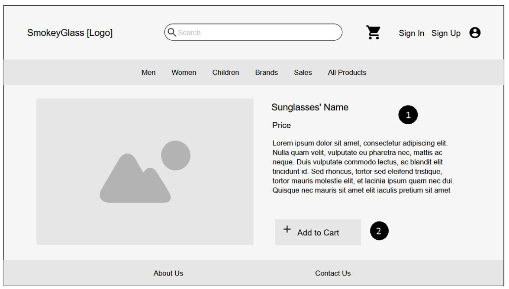

# ER: Requirements Specification

## A1 - SmokeyGlass

Our goal for this project is to develop an online shop, SmokeyGlass, where we will mainly sell sunglasses to the general public.

In order to provide the shop visitors with a more pleasant experience finding the product they're looking for, we give them the ability to filter through all of our products, such as by category or product name. Whenever they find something that interests them, they can see the product's information, check reviews and add it to the shopping cart. 

In order to be able to buy anything from our shop the user needs to authenticate themselves. They can either log in to an already existing account or create a new one by providing a username and a password. Authenticated users have the additional ability to leave reviews, create and manage a wishlist, buy items and checkout. They can also edit personal information or even delete their account at any point.

Besides from users, there will be administrators. They can add new products or delete the existing ones. On top of that, they are able to edit each of their product's information (description, category and price) and manage its stock.
In order to find information about the success of their products, administrators have access to the purchase history of customers. Finally, they are the ones that handle the state of every order related to their products.

We also want to provide notifications to our authenticated users. We intend to inform our buyers that their orders are being processed correctly by warning them when the payment of said orders has been approved and whenever the processing stage of the order changes. The users will also receive a notification when a product in their wishlist becomes available or when the price of a product in their cart has been changed.

The site itself should be user-friendly, responsive, accessible for people with disabilities and have good performance.

-----

## A2 - Actors and User Stories

In this section are presented the actors involved, their information, functionalities and requirements.

 Figure 1. Actors

### 1. Actors

| Identifier | Name |
|---|---|
| User                 | User that gets access to public information, such has the shop items, their details, reviews.                      |
| Visitor              | Unauthenticated user that can register itself or sign-in                                                           |
| Customer             | Authenticated user that is able to wishlist products, buy and review them. He can also check his purchase history. |
| Buyer                | Customer that bought a product.
| Reviewer             | Buyer who reviewed a product he bought.   
| Administrator        | Responsible for management products, users and orders.   |                                                     

### 2. User Stories

This section contains user stories that will help and guide us during the development of this project.

#### 2.1 **User**

| Identifier | Name | Priority | Description |
|---|---|---|---|
| US01       | View Products List   | high | As a User, I want to be able to view to shop's products list, so that I choose something to buy. |
| US02       | View  Product Details  | high  | As a User, I want to view a single product page, so that I can see it's details. |
| US03       | Add Product to Shopping Cart | high | As a User, I want to add products to the shopping cart, so that I can later buy them. |
| US04       | Manage Shopping Cart | high | As a User, I want to be able to manage the shopping cart, so that I can view the products I added before. |
| US05       | Search Products | high | As a User, I want to search products on a search bar, so that I can easily find what I need. |
| US06       | Browse Product Categories | medium| As a User, I want to be view the products from a certain category, so that I can find what I'm looking for. |
| US07       | View Product Reviews  | medium | As a User, I want to view other users' reviews to a product, so that I can get some information on the product quality.
| US08       | Remove Product From Shopping Cart | medium | As a User, I want to remove products from the shopping cart, so that I can delete something I accidentally added.       |

#### 2.2 **Visitor**

| Identifier | Name | Priority | Description |
|---|---|---|---|
| US11      | Log In Account | high | As a Visitor, I want to login to my account, so that I can have access to all the features of the app. |
| US12       | Create An Account | high | As a Visitor, I want to register me in the system, so that I can later authenticate myself. |

#### 2.3 **Customer**

| Identifier  | Name  | Priority  | Description  |
|---|---|---|---|
| US21  | View Profile | high  | As a Customer, I want to check my profile, so that I can have access to all the features of the app.  |
| US22  | Edit Profile  | high  | As a Customer, I want to be able to edit my profile, so that I can change my personal information.  |
| US23  | Logout From Account | high  | As a Customer, I want to be able logout, so that I exit my account.  |
| US24  | View Purchase History | high  | As a Customer, I want to view my purchase history, so that I can see what I previously bought.  |
| US25  | Checkout | high  | As a Customer, I want to checkout, so that I can pay for the products I choose and ship them to the selected address.  |
| US26  | View Wishlist | medium | As a Customer, I want to view my wishlist, so that I add to my cart something I added before to the list.  |
| US27  | Add Product to Wishlist | medium | As a Customer, I want to add a product to my wishlist, so that I can easily find it later to add to the cart.  |
| US28  | Remove Product From Wishlist | medium  | As a Customer, I want to remove a product from my wishlist, so that I can delete products I no longer want.  |
| US29  | Manage Multiple Payment Methods | low  | As a Customer, I want to have multiple payment methods available, so that I can select the one I prefer.  |
| US210  | Report Review | low  | As a Customer, I want to be able to report another user reviews that I find inappropriate, so that the administrators can deleted them.  |
| US211  | Manage Account Credits | low  | As a Customer, I want add credits to my account, so that I can used them as a faster way of payment.  |
| US212  | Have Product Recommendations | low  | As a Customer, I want to have product recommendations, so that I receive some suggestions in what to buy.  |

#### 2.4 **Buyer**

| Identifier  | Name  | Priority  | Description  |
|---|---|---|---|
| US31  | Review Purchased Product | medium | As a Buyer, I want to be able to leave a review to a product, so that other users know my opinion about said product.  |
| US32  | Cancel Order | medium | As a Buyer, I want to be able to cancel my order, so that I don't receive a product that I no longer need.  |
| US33  | Track Order | medium | As a Buyer, I want to be able to track my order, so that I know where my order is at all time.  |
| US34  | Payment Approved | medium | As a Buyer, I want to receive a notification when my payment is approved, so that I know everything is going well with my order.  |
| US35  | Change in Order Processing Stage | medium | As a Buyer, I want to receive a notification when there's a change in a order processing stage, so that I know that my order is being processed correctly.  |
| US36  | Product in Wishlist Available | low | As a Buyer, I want to receive a notification when a product in my wishlist is available, so that I can buy it as soon as possible.  |
| US37  | Product on Cart Price Change | low | As a Buyer, I want to receive a notification when a product in my cart changes price, so that I can decide if I want to buy it or not.  |

#### 2.5 **Reviewer**

| Identifier  | Name  | Priority  | Description  |
|---|---|---|---|
| US41  | Edit Review | medium | As a Reviewer, I want to be able to edit my review, so that I can fix a typo.  |
| US42  | Delete Review | medium | As a Reviewer, I want to be able to remove one of my own reviews that I don't find useful anymore.  |

#### 2.6 **Administrator**

| Identifier  | Name  | Priority  | Description  |
|---|---|---|---|
| US51 | Search for other User Accounts | high | As an Administrator, I want to search for other users' accounts, so that I find the user I'm looking for.  |
| US52 | View other User Accounts | high | As an Administrator, I want to view another users' accounts, so that I see what they are doing.  |
| US53 | Edit other User Accounts | high | As an Administrator, I want to edit other users' accounts, so that I remove any improper information.  |
| US54 | Create user account | high | As an Administrator, I want to Add and Delete Products, so that I can control what products are being sold.  |
| US55 | Add/Delete Products | medium | As an Administrator, I want to Add and Delete Products, so that I can control what products are being sold.  |
| US56  | Manage Products Information | medium  | As an Administrator, I want to Manage Products Information, so that the users know what the product is like.  |
| US57  | Manage Products Stock | medium  | As an Administrator, I want to Manage Products Stock, so that the users know when a item is sold out or in stock. |
| US58  | View Sales Statistics | medium | As an Administrator, I want to View Sales Statistics, so that I know if I am making more money or not.  |
| US59  | Manage Product Categories | low | As an Administrator, I want to Manage Product Categories, so that the users can search for the correct categories.  |
| US510  | View Users’ Purchase History | low | As an Administrator, I want to View Users’ Purchase History, so that I can know what items make more money.  |
| US511  | Manage Order Status | low | As an Administrator, I want to Manage Order Status, so that the user knows where his package is. |
| US512  | Manage Product Discounts | low | As an Administrator, I want to Manage Product Discounts, so that I can quickly dispatch items that I don't want to sell anymore. |

### 3. Suplementary Requirements

This section contains the project's business rules, technical requirements and restrictions.

#### 3.1 **Business Rules**

| Identifier  | Name | Description  |
|---|---|---|
| BR01 | Deleted User Account |  When a user account is deleted, his reviews aren't deleted but made anonymous. |
| BR02 | Administrators Account | Administrators accounts are independent of the user accounts, they cannot buy products. |

#### 3.2 **Technical Requirements**

| Identifier  | Name | Description  |
|---|---|---|
| TR01 | Performance | The system's response times must be shorter than 2s to guarantee the user's attention. |
| TR02 | Robustness | The system must be able to keep working in the event of an runtime error. |
| TR03 | Scalability | The system must be able to handle the increasing number of users and their actions. |
| TR04 | Accessibility | The system should be accessible to everyone, regardless of the web browser. |
| TR05 | Availability | The system should be always available. |
| **TR06** | Security | The system must be able to protect private data from undivided access. |
| **TR07** | Usability | The system must be user-friendly, that is, easy to use and simple. |
| TR08 | Database | The PostgreSQL Database management system must be used. |
| TR09 | Web Application | The system should be implemented as a web application with dynamic pages. |
| **TR10** | Portability | The server-side system should work across different platforms (Windows, Linux, Mac OS, etc.). |
| TR11 | Ethics | The system must respect software development ethics, that is, user data should not be collected/shared without the user's consent. |

The three requirements that we find the most important are TR06, TR07 and TR10. We chose **Security** because we feel that, as a system that deals with monetary transactions, security is essential.

Since the system is designed to users of all ages, with different degrees of technological experience, good **Usability** is essential to guarantee every customer can easily make use of our system.

Finally, we picked **Portability** because, in order to reach a larger number of customers, the system should be able to work in the main platforms.

#### 3.3 **Restrictions**

| Identifier  | Name | Description  |
|---|---|---|
| C01 | Deadline | The system should be ready to be used at the end of the semester, to be able to be evaluated. |

## A3 - Information Architecture

This section contains the shop's sitemap where we explain the connection between the different parts of the site and a set of wireframes where we represent the aesthetic part of the shop. 

### 1. Sitemap

Our system is organized in five main areas, the **User Pages**, which include the user's profile and functionalities, the **Authentication Pages**, that include the sign in and sign up pages, the **Static Pages**, that contain the information about the shop, the **Admin Pages**, where the administrators manage the system and the **Item Catalog Pages**, that allow the user to access the shop's products.

 Figure 2. Sitemap

### 2. Wireframes

#### 2.1 **UI01**: Home Page

1. Search bar: Allows the user to search for a specific product.
2. User Space: Where the user can manage their shopping cart, create an account or log in.
3. Categories: Gives users the ability to filter products.
4. Product Information: Takes the user to the product's individual page.
5. Static Information: Contains the information about the shop.

 Figure 3. Homepage

#### 2.2 **UI10**: Item Information Page

1. Product Information: Contains the name, the price and a small description of the item.
2. Add to Cart button: Allows the user to add the product to their shopping cart.

 Figure 4. Item Information Page

#### 2.3 **UI14**: Sign In Page

1. User Credentials: In order to log in, the user has to provide their username and password.
2. Sign Up Option: Takes the user to the sign up page if they don't have an account.

 Figure 5. Sign In Page

#### 2.4 **UI15**: Sign Up Page

1. User Credentials: In order to register, the user has to provide their email, username and password.
2. Sign In Option: Takes the user to the sign in page if they already have an account.

 Figure 6. Sign Up Page

#### 2.5 **UI12**: Shopping Cart Page

1. Cart details: Shows the user the price and the number of products in their shopping cart.
2. Checkout button: Allows the user to buy the products in the cart.

 Figure 7. Shopping Cart Page

#### 2.6 **UI05**: Profile Page

1. Profile Picture: Shows the user their profile picture.
2. User Information: Displays to the user their personal information
3. Edit Button: Takes the user to the edit profile page where they can change personal information.
4. Ongoing Orders: Allows the user to check their current orders.
5. Order History: Stores the information about all the user's previous orders.

 Figure 8. Profile Page

#### 2.7 **UI06**: Edit Profile Page

1. Edit Image: Gives the user the option to change their profile picture.
2. Edit Information: Where the user alters their personal information.
3. Edit Password: Enables the user to change their password.
4. Save Changes Button: When clicked, the user's information is updated.

 Figure 9. Edit Profile Page

-----

## Revision history

Changes made to the first submission:

1. Added two actors, Buyer and Reviewer. 
2. Changes in the priority of some user stories.

-----

## Authors:
- Ana Beatriz Fontão, up202003574 - editor
- Henrique Seabra Ferreira, up202007044 - editor
- José Pedro Ramos, up202005460
### Date: 
- 03-10-2022